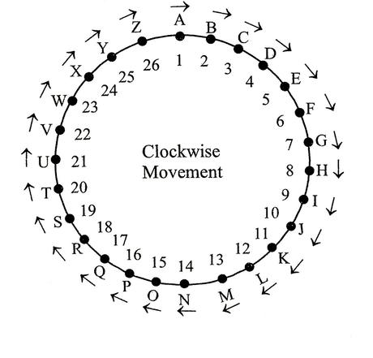

# À l'aise

> Titre: À l&#39;aise  
> Auteur: [Cryptanalyse](https://twitter.com/Cryptanalyse)  
> Difficulté: intro  

## Description

Cette épreuve vous propose de déchiffrer un message chiffré avec la méthode inventée par Blaise de Vigénère. La clé est `FCSC` et le message chiffré est :

```
Gqfltwj emgj clgfv ! Aqltj rjqhjsksg ekxuaqs, ua xtwk n&#39;feuguvwb gkwp xwj, ujts f&#39;npxkqvjgw nw tjuwcz ugwygjtfkf qz uw efezg sqk gspwonu. Jgsfwb-aqmu f Pspygk nj 29 cntnn hqzt dg igtwy fw xtvjg rkkunqf.
```

Le flag est le nom de la ville mentionnée dans ce message.

## Objectif

Il faut déchiffrer le message chiffré à l'aide de la [méthode Vigenère](https://en.wikipedia.org/wiki/Vigen%C3%A8re_cipher).

## Analyse

La [page Wikipedia](https://en.wikipedia.org/wiki/Vigen%C3%A8re_cipher) nous donne des informations sur cet algorithme.

On apprend qu'il peut se modéliser sous la forme algébrique suivante

$$
	C_{i} = E_{k}(M_i) = (M_{i} + K_{i})\mod 26
$$
Avec:
- $E_{k}(M_{i})$ La fonction représentant l'encryption
- $M_{i}$ Le texte à encrypter
- $K_{i}$ La clé permettant l'encryption
- $\mod 26$  Le nombre de lettres dans l'alphabet, pour "revenir au début" si $(M_{i} + K_{i}) > 25$ 

Dans Vigenère, chaque lettre est convertie en nombre de 0 à 25 (a=0, b=1, ..., z=25). Or, si la somme $M_{i} + K_{i}$ est grande, $\mod 26$ permets de boucler sur l'alphabet. L'image ci-contre permets d'illustrer son fonctionnement.



> https://learnfrenzy.com/reasoning/verbal-reasoning/coding-decoding?/reasoning/verbal-reasoning/coding-decoding

### Déchiffrement

Il suffit d'isoler $M_{i}$ dans notre équation
$$
\begin{align*}
	E_{k}(M_{i}) = (M_{i} + K_{i}) \mod 26 \\
	E_{k}(M_{i}) - K_{i} = M_{i} \mod 26 \\
	M_{i} = E_{k}(M_{i}) - K_{i} \mod 26 \\
\end{align*}
$$
NB: Le $\mod 26$ a été déplacé de côté puisque qu'il faut garder un résultat inclus dans l'alphabet.

Bien que l'équation soit résolue, procéder caractère par caractère serait une perte de temps au vu de la longueur du message (210). Il nous suffit donc d'utiliser notre ami [Python](https://python.org)
J'écris donc le script suivant

```python
from string import ascii_lowercase

def vigenere_decrypt(ciphertext: str, key: str) -> str:
	result = []
	
	key = key.lower()
	
	index = 0 # We want to keep track of the current character in the key
	
	for char in ciphertext:
	
		if char.isalpha(): # Ignore space and punctuations
		
		char_pos = ascii_lowercase.index(char.lower())
		
		key_pos = ascii_lowercase.index(key[index % len(key)])
		
		# Here, we evaluate the character
		
		m_i = (char_pos - key_pos) % 26
		
		# Then, we turn back the position into an actual letter
		
		decrypted_char = ascii_lowercase[m_i].upper()
		
		if char.isupper(): # uppercases arent changed at all
	
			decrypted_char = decrypted_char.upper()
	
		result.append(decrypted_char)

		index += 1
	
	else:
		# No changes were applied, just append
		
		result.append(char)
		
		return ''.join(result)

  

print(vigenere_decrypt(("Gqfltwj emgj clgfv ! Aqltj rjqhjsksg ekxuaqs, ua xtwk n&#39;feuguvwb gkwp xwj, ujts f&#39;npxkqvjgw nw tjuwcz ugwygjtfkf qz uw efezg sqk gspwonu. Jgsfwb-aqmu f Pspygk nj 29 cntnn hqzt dg igtwy fw xtvjg rkkunqf."), "FCSC"))
```

Et obtient donc le message suivant

```
BONJOUR CHER AGENT ! VOTRE PROCHAINE MISSION, SI VOUS L&#39;ACCEPTEZ BIEN SUR, SERA D&#39;INFILTRER LE RESEAU SOUTERRAIN OU SE CACHE NOS ENNEMIS. RENDEZ-VOUS A NANTES LE 29 AVRIL POUR LE DEBUT DE VOTRE MISSION.
```

NB: &#39 réprésente une apostrophe
## Flag

NANTES