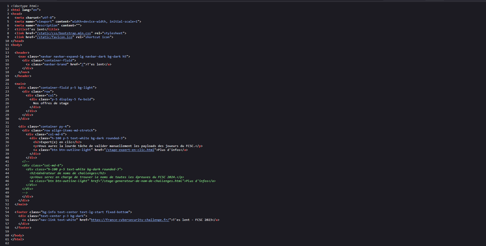
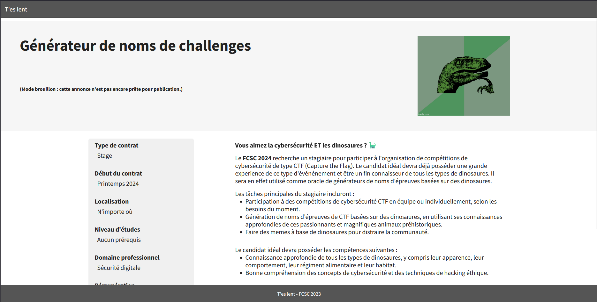
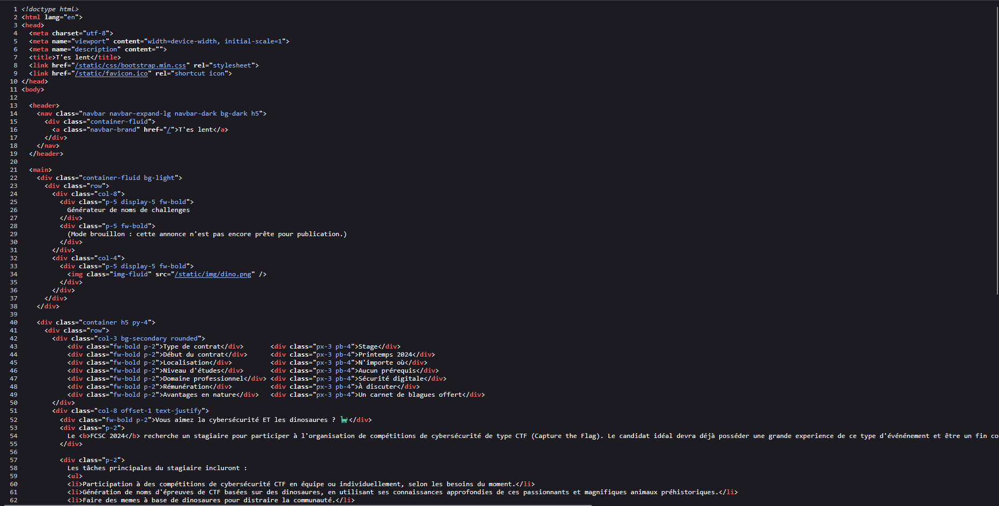
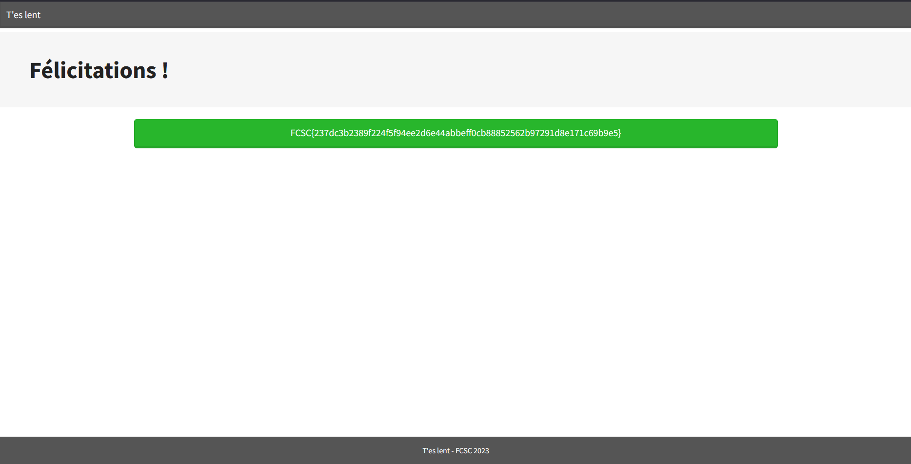

# fcsc2023-web-tes-lent

> Titre: T'es lent  
> Auteur: [Cryptanalyse](https://twitter.com/Cryptanalyse)  
> Difficulté: Intro

## Description

Vous avez très envie de rejoindre l’organisation du FCSC 2024 et vos skills d’OSINT vous ont permis de trouver ce site en construction. Prouvez à l’équipe organisatrice que vous êtes un crack en trouvant un flag !

## Objectif

L'objectif est d'analyser cette application web afin de découvrir le flag.

## Analyse

En accédant à la page principale de l’application, aucune information sensible n’est visible directement à l’écran.

La première étape consiste donc à inspecter le code source HTML de la page (`CTRL + U`)



Nous pouvons apercevoir un commentaire à la ligne 41:

```html
<!--
<div class="col-md-6">
    <div class="h-100 p-5 text-white bg-dark rounded-3">
        <h2>Générateur de noms de challenges</h2>
        <p>Vous serez en charge de trouver le noms de toutes les épreuves du FCSC 2024.</p>
        <a class="btn btn-outline-light" href="/stage-generateur-de-nom-de-challenges.html">Plus d'infos</a>
    </div>
</div>
-->
```

Celui-ci contient un lien. En suivant ce lien (`/stage-generateur-de-nom-de-challenges.html`), on arrive sur cette page:



Aucun lien ne semble apparent, donc rebelote on inspecte le code source de la page (`CTRL + U`)



Cette fois-ci, aucun commentaire caché n'apparait à première vue, en scrollant un peu, il est possible de découvrir ce petit coquin à la ligne 90:

```html
<!--
    Ne pas oublier d'ajouter cette annonce sur l'interface d'administration secrète : /admin-zithothiu8Yeng8iumeil5oFaeReezae.html
-->
```

Suivons donc ce lien (`/admin-zithothiu8Yeng8iumeil5oFaeReezae.html`) et nous tombons sur le flag (`FCSC{237dc3b2389f224f5f94ee2d6e44abbeff0cb88852562b97291d8e171c69b9e5}`)



## Flag

FCSC{237dc3b2389f224f5f94ee2d6e44abbeff0cb88852562b97291d8e171c69b9e5}
