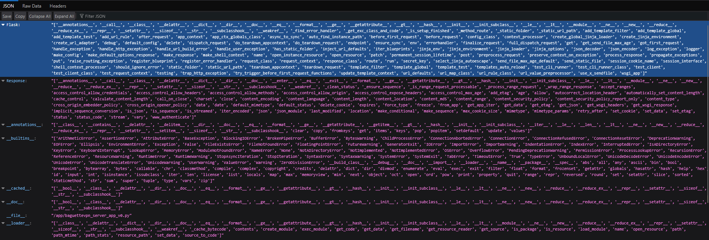
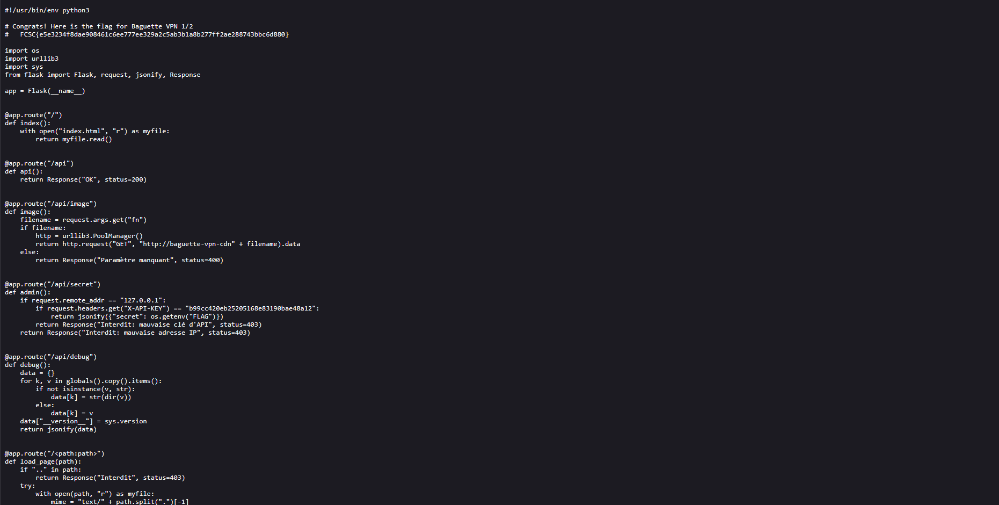

# fcsc2023-web-tes-lent

> Titre: Baguette VPN 1/2  
> Auteur: DrStache  
> Difficulté: 1

## Description

Un nouveau service de VPN vient de faire son apparition ! Essayez d’en apprendre davantage sur le fonctionnement de leur site web.

## Objectif

L'objectif est d'analyser cette application web afin de découvrir le flag.

## Analyse

En accédant à la page principale de l’application, aucune information sensible n’est visible directement à l’écran.


La première étape consiste donc à inspecter le code source HTML de la page (`CTRL + U`):

```html
<!DOCTYPE html>
<html class="js-focus-visible" data-js-focus-visible="" lang="en">
<head>
    ...
</head>
<body class="text-center">
    ...
</body>
</html>

<!-- 
  Changelog :
    - Site web v0
    - /api/image : CDN interne d'images
    - /api/debug
  TODO :
    - VPN
-->
```

Nous pouvons apercevoir un commentaire à la ligne 62, celui-ci indique un changelog contenant des endpoints:

- `/api/image`
- `/api/debug`

La page `/api/image` n’est pas accessible car elle demande un paramètre


Nous allons donc essayer la deuxième page, `/api/debug`.



Celle-ci nous montres les métadonnées de `Flask`, sous le format `JSON`. Nous pouvons apercevoir un champ nommé `__file__`. Dans Flask, la variable `__file__` correspond au chemin du fichier Python qui est exécuté. Laissons cela de côté pour l'instant et essayons d'inspecter notre page web.

De retour à notre page web, essayons de découvrir quelques endpoints sensibles. Prenons par exemple `/admin`, selon les conventions HTML, une page n'existant pas doit retourner une erreur 404, ce qui est le cas ici. Ce qui nous intéresse est surtout le message d'erreur indiqué par la page:

```python
[Errno 2] No such file or directory: 'admin'
```

Cette erreur indique qu'en prenant la route `/admin`, le serveur a essayé de chercher un fichier correspondant nommé `admin`. Comme nous avons découvert juste au-dessus que la page utilise `Flask` en interne, nous pouvons en déduire que notre application utilise une route `catch-all`. Sachant cela, il est donc possible d'accéder au code source du fichier exécuté vu plus tôt, situé dans `app` intitulé `baguettevpn_server_app_v0.py`.



La page nous révèle donc le code source de l'application et confirme nos soupçons concernant la route catch all ainsi que le flag présent en commentaire au début du fichier

```python
@app.route("/<path:path>")
def load_page(path):
    if ".." in path:
        return Response("Interdit", status=403)
    try:
        with open(path, "r") as myfile:
            mime = "text/" + path.split(".")[-1]
            return Response(myfile.read(), mimetype=mime)
    except Exception as e:
        return Response(str(e), status=404)
```

## Flag

FCSC{e5e3234f8dae908461c6ee777ee329a2c5ab3b1a8b277ff2ae288743bbc6d880}
